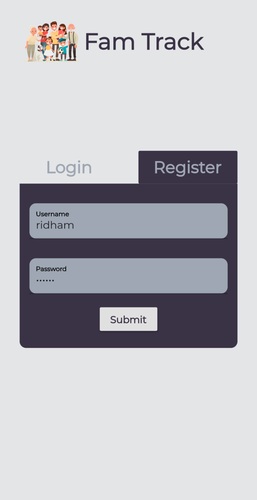
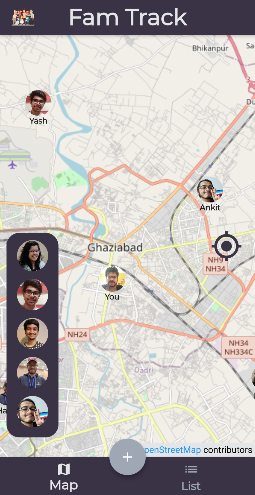
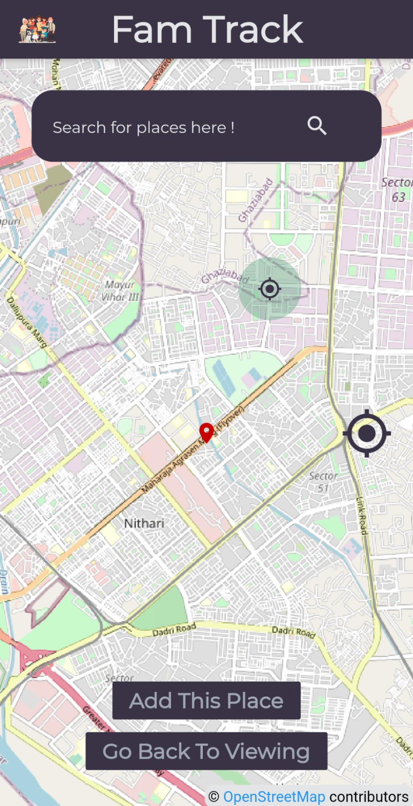

# 👪 FamTrack

 
 
  

An applicaition for not letting your loved ones alone.

## 🚧 Why did we make this?

* Older people who suffer from ailments like Alzheimer's often forget their family members and their homes and it becomes highly difficult to take their care.
* Children need the space to grow but at the same time parent's need to assure their kids safety.

## 🔧 Solution

* **FamTrack** is a smart way to keep an eye on your loved one's well being. 
* It lets the family members add each other and then they can set safe locations for each member individually and when someone is out of those locations for more than thirty minutes, then all the family members get a notification with their current location.
* This is an implementation of GeoFencing with an extra step that the app notifies you of the location changes and you can leave the worries.

## 🔍 Use Cases

* Parents won't have to constantly check the phone and call to ensure everyones safety.
* One can any time check their family member's location and know where they are.
* After setting the safe locations, reminders when a person is away from them can help avoid major accidents.

## 🤔 Unique Selling Point (USP)
GeoFencing has been done before but the extra layer of security by adding automated periodic checking stands us apart.

## 📝 Getting Started
In order to setup the project locally, check the defined setup instructions [here](/setup-instructions.md).

## 💻 Contributors

<table>
  <tr>
    <td align="center"><a href="https://github.com/ridhambhat"> <b>Ridham Bhat</b></a> 
    <td align="center"><a href="https://github.com/HarshCasper"> <b>Harsh Bardhan Mishra</b></a> 
    <td align="center"><a href="https://github.com/Ajitesh13"> <b>Ajitesh Panda</b></a> 
    <td align="center"><a href="https://github.com/farhan2742"> <b>Farhan Kiyani</b></a> 
  </tr>
</table>

## 📸 Screenshots

<table>
    <tr>
     <td></td>
     <td></td>
     <td></td>
    </tr>
</table>

## 📜 LICENSE
[GNU GENERAL PUBLIC LICENSE](LICENSE)
